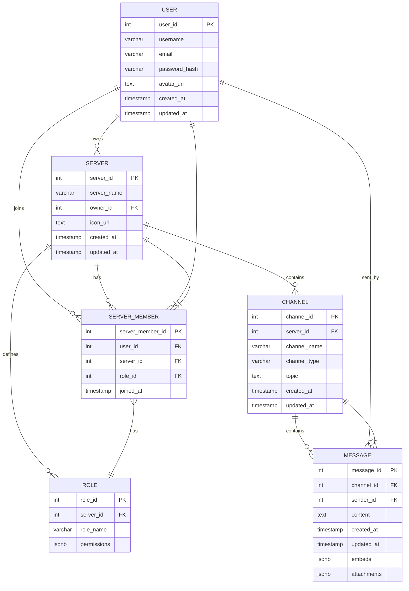

# XCord Database Schema

This document describes the database schema for the XCord project, using PostgreSQL.

## Entity Relationship Diagram (ERD)

## Table Definitions

-- Users Table
CREATE TABLE users (
    user_id SERIAL PRIMARY KEY,
    username VARCHAR(255) UNIQUE NOT NULL,
    email VARCHAR(255) UNIQUE NOT NULL,
    password_hash VARCHAR(255) NOT NULL,
    avatar_url TEXT, -- Optional
    created_at TIMESTAMP WITH TIME ZONE DEFAULT CURRENT_TIMESTAMP,
    updated_at TIMESTAMP WITH TIME ZONE DEFAULT CURRENT_TIMESTAMP
);

-- Servers Table
CREATE TABLE servers (
    server_id SERIAL PRIMARY KEY,
    server_name VARCHAR(255) NOT NULL,
    owner_id INTEGER REFERENCES users(user_id) ON DELETE CASCADE, -- If owner is deleted, server is deleted
    icon_url TEXT, -- Optional
    created_at TIMESTAMP WITH TIME ZONE DEFAULT CURRENT_TIMESTAMP,
    updated_at TIMESTAMP WITH TIME ZONE DEFAULT CURRENT_TIMESTAMP
);

-- Roles Table
CREATE TABLE roles (
    role_id SERIAL PRIMARY KEY,
    server_id INTEGER REFERENCES servers(server_id) ON DELETE CASCADE,
    role_name VARCHAR(255) NOT NULL,
    permissions JSONB -- Store permissions as a JSON object (e.g., {"can_manage_channels": true, "can_kick_members": false})
);

-- Server Members Table (Many-to-many relationship between users and servers)
CREATE TABLE server_members (
    server_member_id SERIAL PRIMARY KEY,
    user_id INTEGER REFERENCES users(user_id) ON DELETE CASCADE,
    server_id INTEGER REFERENCES servers(server_id) ON DELETE CASCADE,
    role_id INTEGER REFERENCES roles(role_id) ON DELETE SET NULL, -- If a role is deleted, the user's role is set to NULL
    joined_at TIMESTAMP WITH TIME ZONE DEFAULT CURRENT_TIMESTAMP,
    UNIQUE (user_id, server_id) -- A user can only join a server once
);

-- Channels Table
CREATE TABLE channels (
    channel_id SERIAL PRIMARY KEY,
    server_id INTEGER REFERENCES servers(server_id) ON DELETE CASCADE,
    channel_name VARCHAR(255) NOT NULL,
    channel_type VARCHAR(50) NOT NULL, -- e.g., 'text', 'voice'
    topic TEXT, -- Optional
    created_at TIMESTAMP WITH TIME ZONE DEFAULT CURRENT_TIMESTAMP,
    updated_at TIMESTAMP WITH TIME ZONE DEFAULT CURRENT_TIMESTAMP
);

-- Messages Table
CREATE TABLE messages (
    message_id SERIAL PRIMARY KEY,
    channel_id INTEGER REFERENCES channels(channel_id) ON DELETE CASCADE,
    sender_id INTEGER REFERENCES users(user_id) ON DELETE SET NULL, -- If user is deleted, message sender is set to NULL
    content TEXT NOT NULL,
    created_at TIMESTAMP WITH TIME ZONE DEFAULT CURRENT_TIMESTAMP,
    updated_at TIMESTAMP WITH TIME ZONE DEFAULT CURRENT_TIMESTAMP,
    embeds JSONB, -- Optional: Store message embeds as JSON
    attachments JSONB -- Optional: Store attachment metadata as JSON
);

## Indexing Strategy

The following indexes are created to improve query performance:

*   `idx_messages_channel_id`:  Speeds up retrieval of messages within a specific channel.
*   `idx_server_members_user_id`:  Speeds up queries related to a user's server memberships.
*   `idx_server_members_server_id`:  Speeds up queries related to members of a specific server.
*   `idx_channels_server_id`: Speeds up retrieval of channels within a specific server.

## Data Type Justification

*   **JSONB:** Used for `permissions`, `embeds`, and `attachments` to allow for flexible storage of semi-structured data within the relational model. JSONB offers better performance and indexing capabilities compared to plain JSON.
*   **TIMESTAMP WITH TIME ZONE:**  Used for all timestamps to ensure accurate and consistent time tracking across different time zones.
* **VARCHAR(255)** Used for names and emails, with a reasonable length limit.
* **TEXT:** Used for potentially long text fields like message content, topic and avatar/icon URLs.
